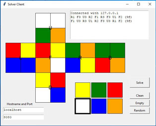

# Rubiks2x2x2-OptimalSolver
## Overview
This project implements an optimal solver for the 2x2x2 Rubik's cube. All optimal (=shortest) solving maneuvers are computed. The computation time is neglectible.
The solver only uses moves of the U, R and F faces because the DBL-corner is fixed. The color scheme of the cube is detected automatically.

## Usage
There is a pruning table which is created on the first run. This needs about 4 MB disk space and it takes from less than a minute to a couple of minutes to create it, depending on the hardware. Usually you start the cubesolving server which listens on a port of your choice and which accepts the cube definition string and returns the solving maneuver. The module example.py gives detailed examples how to start the server and a simple GUI-interface which interacts with the server. You can run the example file with

"python example.py" or eventually "python3 example.py"

Make sure that you use Python 3.

